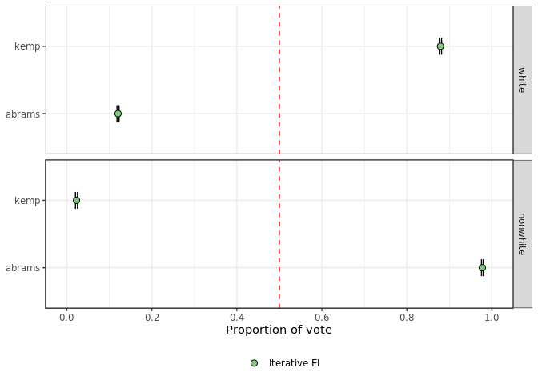

# eiCompare 
[](https://github.com/RPVote/eiCompare/actions?workflow=R-CMD-check)
[](https://github.com/RPVote/eiCompare/actions?workflow=Styler)

`eiCompare` is an R package built to help practitioners and academics quantify racially polarized voting (RPV) with ease and confidence. It builds on top of several existing packages, augmenting their utility for measuring racially polarized voting in elections. Underlying packages include `ei`, `eiPack`, `wru`, and `censusxy`. 

`eiCompare` was built with several types of users in mind:

- Expert witnesses in voting rights litigation who need to accurately quantify vote dilution in an area and present the results convincingly to a judge or jury.
- National voting rights advocacy organizations trying to identify elections across the country where vote dilution might be at play.
- Grassroots organizations looking for data-driven tools to fuel their fight against vote dilution at the local level.
- Academics who study the causes and consequences of vote dilution and racially polarized voting.

## News

### 3.0 Update:

The Voting Rights Team of the 2020 University of Washington Data Science for Social Good Fellowship program worked throughout the summer to develop the latest iteration of the package. Highlights from the update include:

- Functions for geocoding addresses on voter files.
- Improved accuracy of BISG estimation through surname preprocessing.
- Refactored code for ecological inference functions.
- Parallel processing to speed up ecological inference and geocoding.
- New built-in visualizations of EI results and estimation diagnostics.
- Performance analysis tools for comparing different election maps.
- Functions for preprocessing address data, surname data, data for ecological inference.

See [here](NEWS.md) for a full list of new features. 

## Installation

### From CRAN

CRAN submission is currently underway. Check back soon for instructions on installation from CRAN.

### From Github (development version)

Install latest development version with:

```
remotes::install_github('RPVote/eiCompare')
```

## Usage

The name `eiCompare` highlights the utility of this package for comparing different ecological inference estimates. For instance, the following code compares iterative and RxC estimates of racial voting preferences in a stylized version of the 2018 Georgia gubernatorial election:

``` r
library(eiCompare)
data("gwinnett_ei")

iter <- ei_iter(
  data = gwinnett_ei,
  cand_cols = c("kemp", "abrams", "metz"),
  race_cols = c("white", "black", "other"),
  totals_col = "turnout",
  name = "Iterative EI",
)

rxc <- ei_rxc(
  data = gwinnett_ei,
  cand_cols = c("kemp", "abrams", "metz"),
  race_cols = c("white", "black", "other"),
  totals_col = "turnout",
  name = "RxC EI",
)

plot(iter, rxc)
```

<div style="text-align:center"></div>

The top panel shows that the majority of white voters voted for Brian Kemp, who won this election. The middle panel shows the estiamted preferences of black voters. The estimates indicate that black voters strongly preferred Stacey Abrams over Brian Kemp.

Please refer to the package vignettes for detailed walkthroughs of how this package facilitates ecological inference. To view these in Rstudio, enter `browseVignettes("eiCompare")` in the console after installing the package.


## Learn More

- To learn about R programming, see [Hands-On Programming with R](https://rstudio-education.github.io/hopr/) and [R for data science](https://r4ds.had.co.nz/)
- To learn more about the role of ecological inference in voting rights, visit the [eiCompare website](https://rpvote.github.io/voting-rights/)
