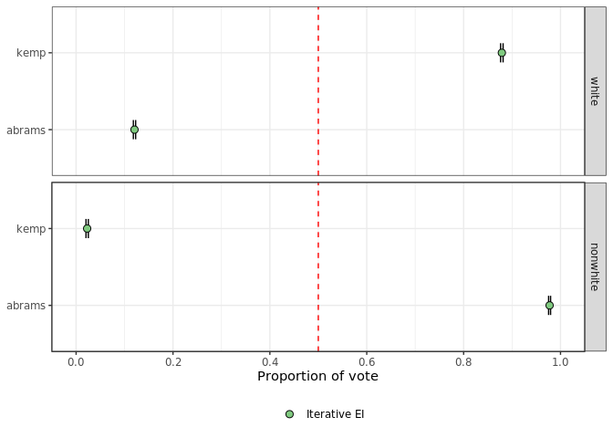

# eiCompare 
[](https://github.com/RPVote/eiCompare/actions?workflow=R-CMD-check)
[](https://github.com/RPVote/eiCompare/actions?workflow=Styler)

`eiCompare` is an R package built to help practitioners and academics quantify racially polarized voting (RPV) with ease and confidence. It builds on top of several existing packages, augmenting their utility for measuring racially polarized voting in elections. Underlying packages include `ei` and `eiPack`.

`eiCompare` was built with several types of users in mind:

- Expert witnesses in voting rights litigation who need to accurately quantify vote dilution in an area and present the results convincingly to a judge or jury.
- National voting rights advocacy organizations trying to identify elections across the country where vote dilution might be at play.
- Grassroots organizations looking for data-driven tools to fuel their fight against vote dilution at the local level.
- Academics who study the causes and consequences of vote dilution and racially polarized voting.

## News

# eiCompare 3.0.6

## Bug fixes and improvements

* `ei_good()` now returns an `eiCompare` class object, consistent with `ei_iter()` and `ei_rxc()`. Output works directly with `summary()`, `rpv_toDF()`, and `rpv_plot()`.
* `rpv_toDF()` now correctly handles `ci_95_lower`/`ci_95_upper` column names from `rpv_normalize()` output.
* `rpv_normalize()` returns an informative error when passed `ei_good()` output.
* Switched maintainer to Loren Collingwood (lcollingwood@unm.edu)
* Added RPV analysis vignette

# eiCompare 3.0.5

## New function

* included extract_rxc_precinct() function to extract precinct level estimates from ei_rxc()

# eiCompare 3.0.4

## Package changes
* added rpv_normalize() function
* removed wru dependency
* incorporated rpv_coef_plot() and rpv_toDF() functions from eiExpand package
* edited ei_iter() to have flexible CI parameters (default is 0.95) using bayestestR for calculation and updated column naming, and to use reproducible parallel processing (.inorder=TRUE)
* edited ei_rxc() with reproducible parallel processing and changed column naming to fit ei_iter()
* Fixed summary.eiCompare() print behavior
* Added viridis to imports for color visualization and updated RoxygenNote to 7.3.2

See [NEWS.md](NEWS.md) for a full changelog.

## Installation

### From Github (development version)

Install latest development version with:

```
remotes::install_github('RPVote/eiCompare')
```

## Usage

The name `eiCompare` highlights the utility of this package for comparing different ecological inference estimates. The package provides three EI methods:

- **Goodman's Regression** (`ei_good()`) -- A fast, deterministic method based on ecological regression. Useful as a baseline estimate.
- **Iterative EI** (`ei_iter()`) -- King's (1997) iterative 2x2 ecological inference method with Bayesian estimation.
- **RxC EI** (`ei_rxc()`) -- Multinomial-Dirichlet model for simultaneous estimation across all race-candidate pairs.

All three functions return `eiCompare` class objects that work with `summary()`, `rpv_toDF()`, and visualization functions.

### Quick example

The following code estimates racial voting preferences in the 2018 Georgia gubernatorial election using Gwinnett County data:

``` r
library(eiCompare)
data("gwinnett_ei")

cands <- c("kemp", "abrams", "metz")
races <- c("white", "black", "other")

# Goodman's Regression (fast baseline)
good <- ei_good(
  data = gwinnett_ei,
  cand_cols = cands,
  race_cols = races,
  totals_col = "turnout"
)
summary(good)

# Iterative EI
iter <- ei_iter(
  data = gwinnett_ei,
  cand_cols = cands,
  race_cols = races,
  totals_col = "turnout",
  name = "Iterative EI"
)

# RxC EI
rxc <- ei_rxc(
  data = gwinnett_ei,
  cand_cols = cands,
  race_cols = races,
  totals_col = "turnout",
  name = "RxC EI"
)

# Compare results
plot(iter, rxc)
```

<div style="text-align:center"></div>

The top panel shows that the majority of white voters voted for Brian Kemp, who won this election. The middle panel shows the estimated preferences of black voters. The estimates indicate that black voters strongly preferred Stacey Abrams over Brian Kemp.

### RPV visualization with eiExpand

Use `rpv_toDF()` to convert results into a format compatible with `eiExpand::rpv_plot()`:

``` r
library(eiExpand)

# Convert ei_iter results to plot-ready dataframe
iter_df <- rpv_toDF(
  rpv_results = iter,
  model = "ei",
  jurisdiction = "Gwinnett",
  candidate = c("Kemp", "Abrams", "Metz"),
  preferred_candidate = c("White", "Black", "Other"),
  party = c("Republican", "Democratic", "Libertarian"),
  election_type = "General",
  year = "2018",
  contest = "Governor"
)

# Plot RPV results
rpv_plot(iter_df)
```

### VAP-denominator normalization

When using voting age population (VAP) as the denominator (instead of total votes), use `rpv_normalize()` to condition estimates on voters only:

``` r
# Run EI with a NoVote column
iter_vap <- ei_iter(
  data = my_data,
  cand_cols = c("pct_cand1", "pct_cand2", "pct_novote"),
  race_cols = c("pct_white", "pct_black"),
  totals_col = "total_vap"
)

# Normalize to remove NoVote
norm <- rpv_normalize(
  ei_object = iter_vap,
  cand_cols = c("pct_cand1", "pct_cand2"),
  race_cols = c("pct_white", "pct_black")
)

# Convert to plot-ready format
norm_df <- rpv_toDF(
  rpv_results = norm,
  model = "ei vap",
  ...
)
```

Please refer to the package vignettes for detailed walkthroughs. To view these in RStudio, enter `browseVignettes("eiCompare")` in the console after installing the package.

## Platform dependencies

The following platform dependencies may be required on Ubuntu/Debian based systems:
sudo apt install libfftw3-dev fftw-dev

## Learn More

- To learn about R programming, see [Hands-On Programming with R](https://rstudio-education.github.io/hopr/) and [R for data science](https://r4ds.had.co.nz/)
- To learn more about the role of ecological inference in voting rights, visit the [eiCompare website](https://rpvote.github.io/voting-rights/)
