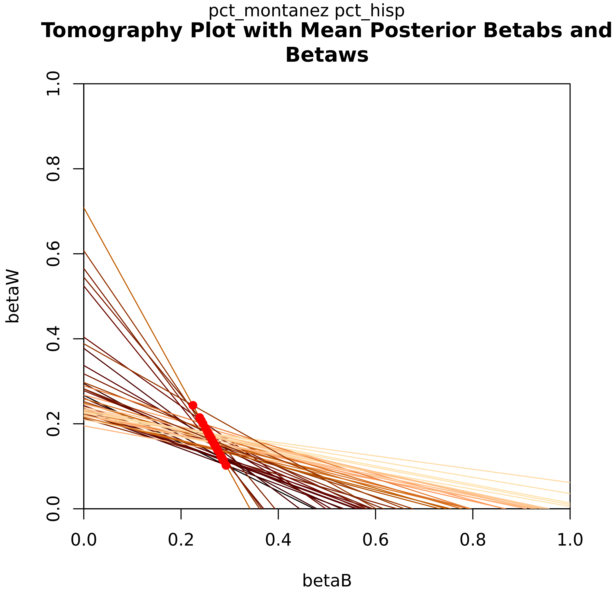
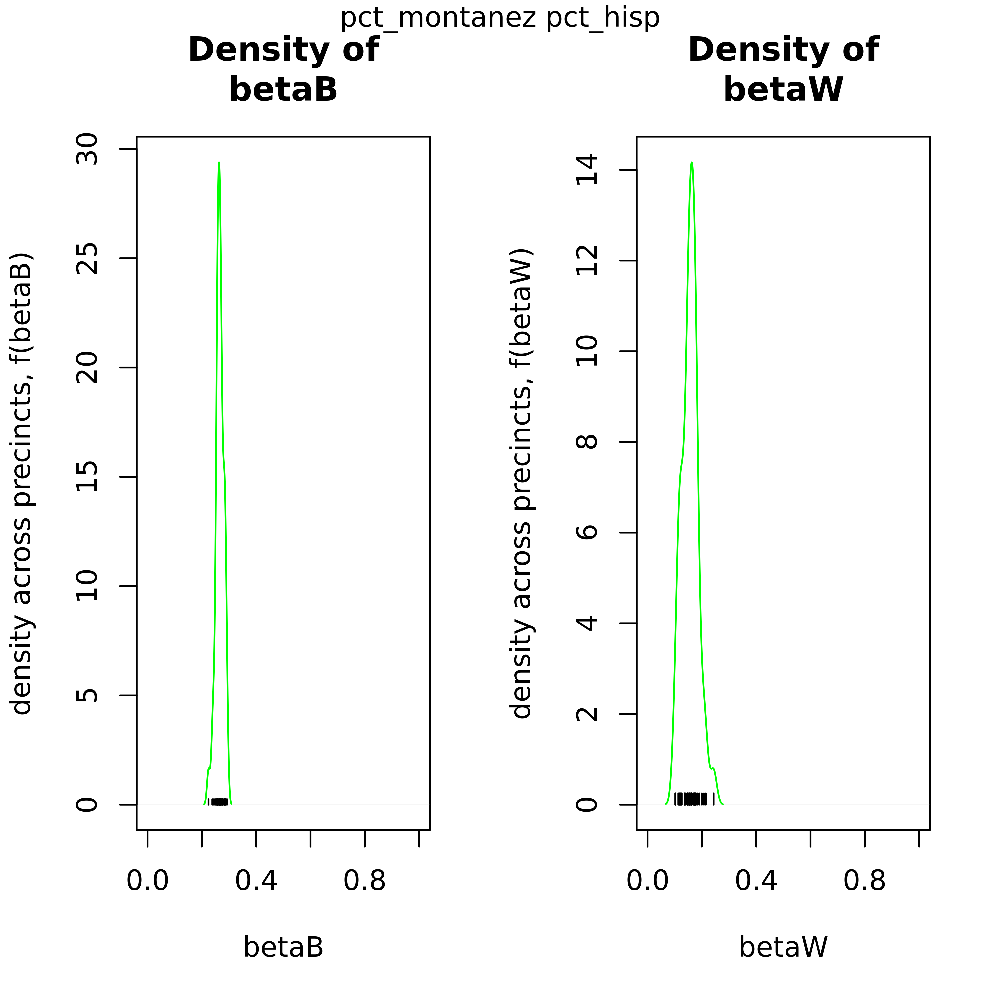
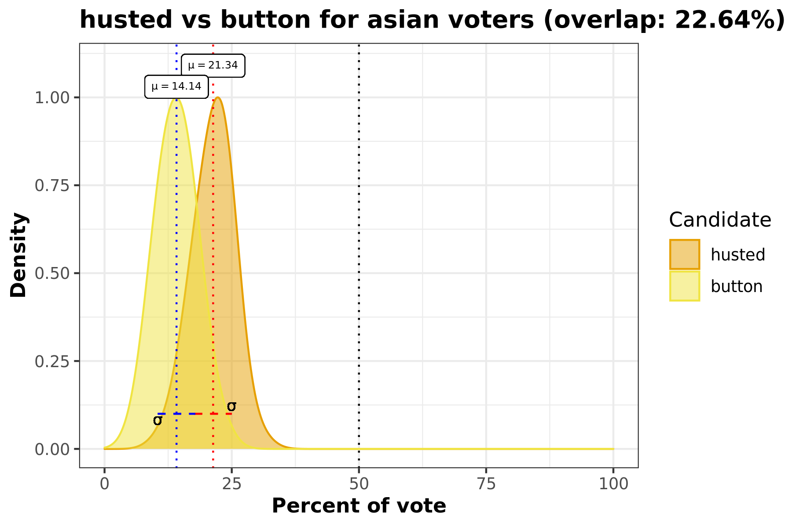
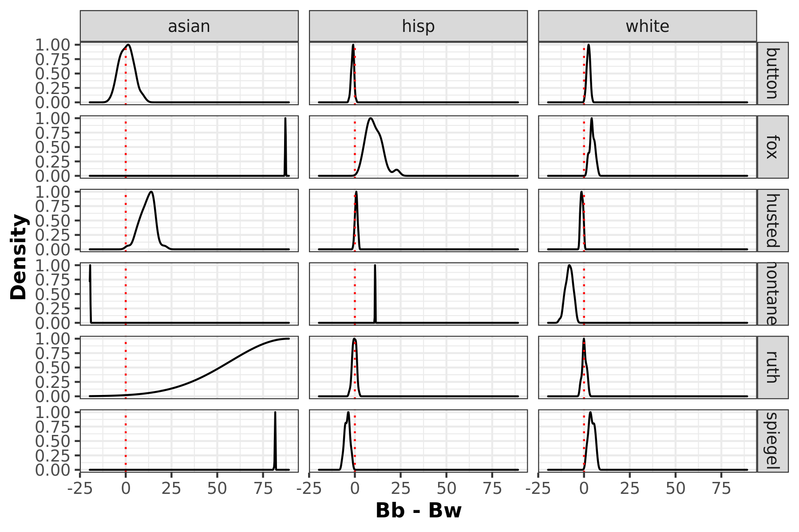

```{r setup, include = FALSE}
knitr::opts_chunk$set(
  warning = FALSE,
  comment = "#>"
)

# devtools::install_github("DSSG-eiCompare/eiCompare@rxc_visualizations")
library(eiCompare)

# install.packages("doSNOW" )
library(doSNOW)

data("corona")
```

This vignette aims to highlight the functionalities within eiCompare to produce plots. These visualizations include:

- _Tomography plots_

  Each line on the graph represents $\beta^b$ and $\beta^w$ each geographical unit (i.e. precinct). Not only does this plot graphically show the bounds those values have, the overlayed contours show which values on those lines have the highest probability of being an accurate estimate.
  
- _Density $\beta^b$ and $\beta^w$ comparison plots_

  As an output from iterative ei, these 2-pane plots compare the distribution of $\beta^b$  and $\beta^w$ to show the uncertainty of the point estimates.

- _Density voter choice comparison plots for each race_

  This density plot comparison answers the question "How did Candidate A and Candidate B's votes for race C compare?". This visualization includes information such as standard deviation, avergae percentage of race C voters, and overlap percentage.
    
- _MCMC convergence density plots_

  Using `coda`, `ei_rxc()` can create diagnostic plot to assess convergence of the Markov Chain Monte Carlo (MCMC) and visualize the parameter fluctuations over iterations and its distribution. It is recommended to do a diagnostic run and assessing these results prior to running the full RxC analysis.


- _Summary plot to compare iterative ei and RxC results_

  As discussed in Barreto, Collingwood, Garcia-Ross, and Oskooii's study, RxC and iterative EI should produce similar results. This output visualizes the difference seen in these two methods.
  

## Introducing our example data set: Corona, CA

The data we'll be using for this example is from 2014 elections in California, specifically looking at voting results and racial demogrphiacs for Corona by precinct.

```{r}
head(corona)
```

We have a row for every precinct, if we check the dimensions of our dataset you will see that this is 46. We also have 12 variables included in this dataset.
```{r}
print(dim(corona))
names(corona)
```

The variables are as follows:
  - `precinct`: Precinct ID number     
  
  - `totvote`: Total number of votes cast
  
  - `pct_husted`: Percent of voting precinct population who voted for Husted
  
  - `pct_spiegel`: Percent of voting precinct population who voted for Spiegel
  
  - `pct_ruth`: Percent of voting precinct population who voted for Ruth   
  
  - `pct_button`:  Percent of voting precinct population who voted for Button 
  
  - `pct_montanez`: Percent of voting precinct population who voted for Montanez
  
  - `pct_fox`: Percent of voting precinct population who voted for Fox     
  
  - `pct_hisp`: Percent of voting precinct population who identify as Hispanic 
  
  - `pct_asian`: Percent of voting precinct population who identify as Asian  
  
  - `pct_white`: Percent of voting precinct population who identify as White 
  
  - `pct_non_lat`: Percent of voting precinct population who identify as Non-Latino
  
  

Non-Latino encompasses the Asian and White voting population.
```{r}
corona$pct_hisp + corona$pct_non_lat == 1
```

So for this analysis there are 5 candidates (Husted, Spiegel, Ruth, Button, and Montanez) and 3 racial groups (Hispanic/Latino, Asian, and White). 


## `ei_iter()`: Tomography, Density comparison, Density voter choice

With that, let's run ei_ter to output the first set of visuals. If you want to to opt to create plots for `ei_iter` you'll need to set `plots` to `TRUE`. 

In addition, if you'd like to specificy where you would like to save your plots, you can specify a `plots_path`. In this example we'll just set it to where this vignette lives.

``` {r}
save_path <- "~/hikari-stuff/eiCompare/vignettes/"
```

Time to run our iteraative ei!

```{r}
cand_cols <- c("pct_husted", "pct_spiegel", "pct_ruth", "pct_button", "pct_montanez", "pct_fox")
race_cols <- c("pct_hisp", "pct_asian", "pct_white")
totals_col <- "totvote"

# Run with plots =
ei_results <- ei_iter(corona, cand_cols, race_cols, totals_col,
  plots = TRUE, plot_path = save_path
)
```

Now that's completed, we'll walk through each plot type that is generated from `ei_iter`.


### Tomography

Let's look at the tomography plot for the Candidate for the Hispanic demographic. Each line on this graph represents a precinct, showing the posterior values for $\beta^b$ and $\beta^w$. One of the key features here is that this informs the bounds for these values for each precinct. The red dots indicate their point estimates.

```{r echo=FALSE, out.width='100%'}


```


### Density $\beta^b$ and $\beta^w$ comparison plots

These plots can be used to confirm this point estimate distributions for $\beta^b$ and $\beta^w$ across precints. The green density curve allows for insight into the location of this point estimate as well as assess the associated uncertainty. Black tick marks at the bottom indicate the locations of each point estimate that was calculated. 

```{r echo=FALSE, out.width='100%'}


```

### Density voter choice comparison plots for each race

This overlaid density plot answers the question "How do voters from a certain racial demographic vote for two candidates across all precincts?" In this particular example we're looking at the Hispanic population and comparing how they voted for Husted and Button in this election. We can see that there is almost 30% of overlap between the density curves for these two candidates.

```{r echo=FALSE, out.width='100%'}


```


### Racial polarized voting density plots

Racially polarized voting by taking the difference of the posterior distribution of the district level aggregates of $\beta^b$ and $\beta^w$. The furthere the distribtuion mean is away from 0, the higher possibility of RPV.


```{r echo=FALSE, out.width='100%'}


```


## `ei_rxc()`: Density voter choice, MCMC convergence

`ei_rxc` also has capabiltiies to create density voter choice plots. But keep in mind these may take a long time to run depedning on what you specify for draws. You can opt into creating these plots as in `ei_iter` by toggling `plots = TRUE`.

In addition, to assess your RxC parameter set up, we recommend running a diagnostic test first. By toggling to `diagnostic = TRUE` you will be able to conduct a MCMC chain analysis and test for convergence. 


```{r}
rxc_diag <- ei_rxc(
  data = corona, cand_cols, race_cols, totals_col, diagnostic = TRUE,
  par_compute = TRUE, verbose = TRUE
)
```


The following plots are created by using the `coda` package.

### Trace and marginal density plots

`coda` enables creating trace and density plots, side-by-side for each parameter, with ease. Trace plots show the calculated parameter for each iteration. If there seems to be a chain lags to join the rests' mode, this is an indication you'd want to increase the burn-in period. On the other hand, the marginal density plots show the distribution of this parameter. You're looking for a bell curve here-- if its lumpy you'll want to run the algorithm longer.


```{r echo=FALSE,  out.width='0.75\\linewidth'}
knitr::include_graphics("trace_density.pdf")
```


### Gelman-Rubin diagnostic plot
The Gelman-Rubin diagnostic is one method to test for convergence to see if the sample is close to the posterior distribution. You'll get one plot for each parameter and produces the scale reduction factor. In these plots you'll be looking to for values below a factor of ~1.1 so these plots will give you a good sense of any changes you'll need for burn-in.

```{r echo=FALSE,  out.width='0.75\\linewidth'}
knitr::include_graphics("gelman.pdf")
```


## EI and RxC comparison chart
The `ei_rc_good_table` function lets the user compare the distribution of their ei and rxc results. This plot is one method to double check RxC parameter settings and enable users to go back and check over their work.

First let's run the rxc:
```{r}
rxc_results <- ei_rxc(
  data = corona, cand_cols, race_cols, totals_col, diagnostic = FALSE,
  par_compute = TRUE, verbose = TRUE
)
```

And now we can combine our results to compare their distributions.
```{r}
ei_rc_combine <- ei_rc_good_table(ei_results, rxc_results,
  groups = c("Latino", "Asian", "White")
)
plot(ei_rc_combine)
```
