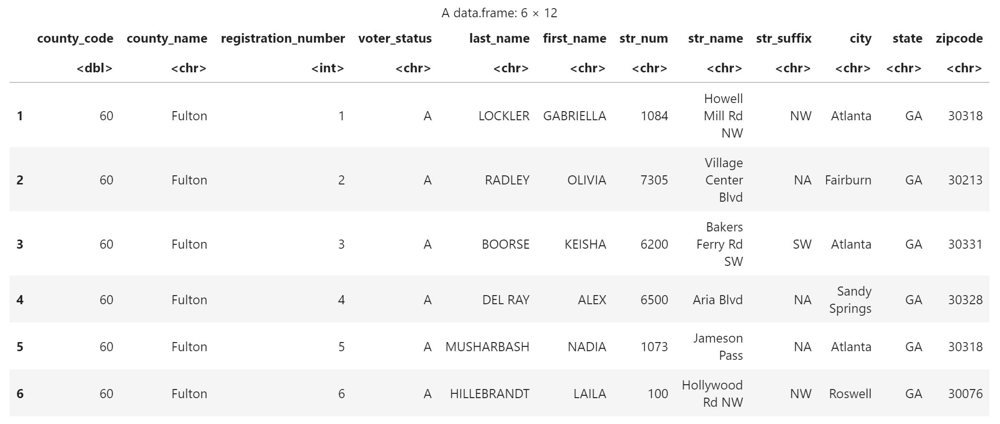
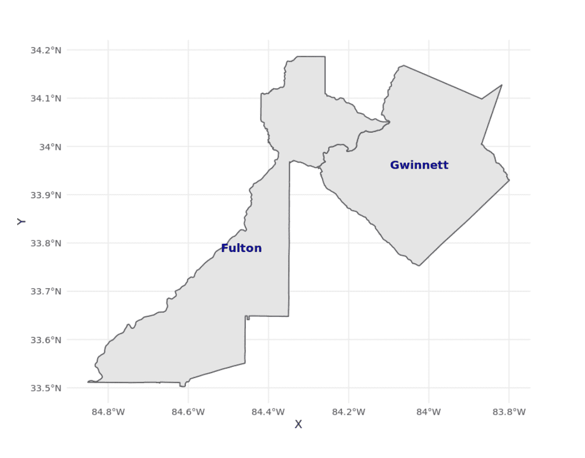
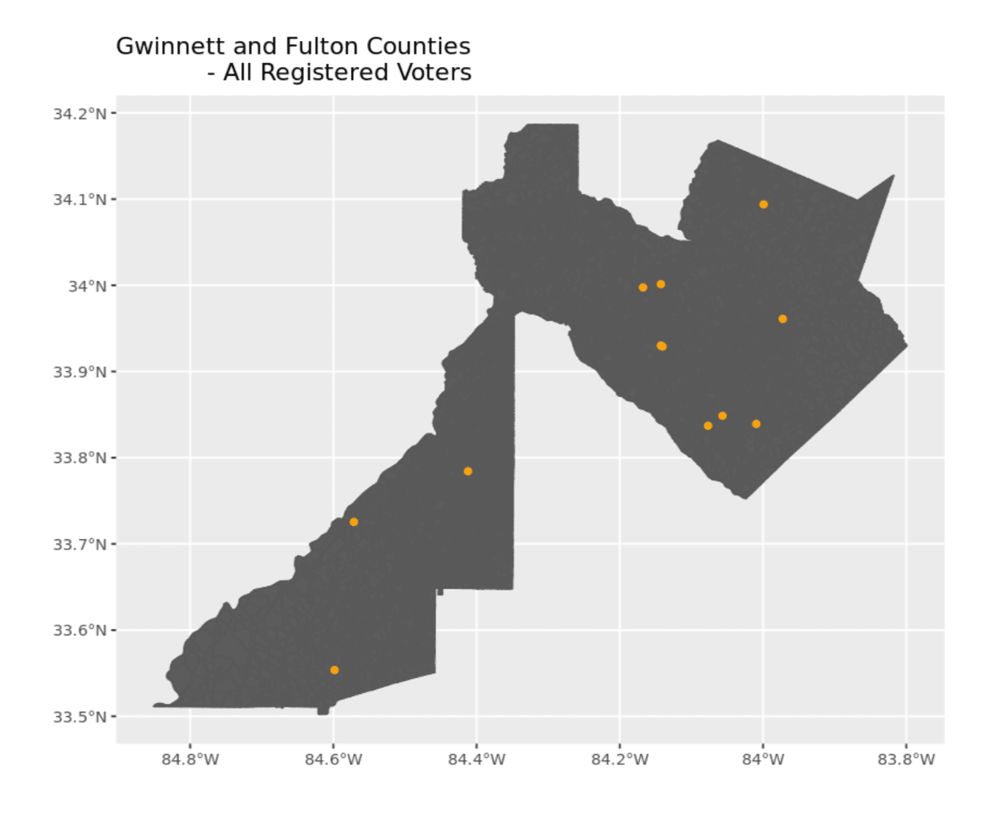
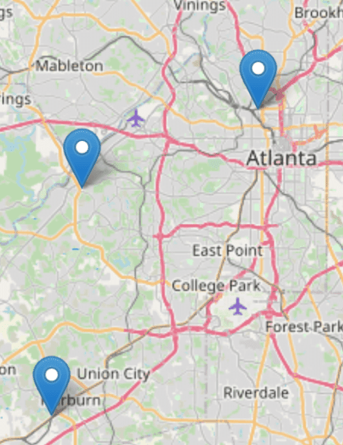

```{r, include = FALSE}
knitr::opts_chunk$set(
  collapse = TRUE,
  comment = "#>"
)
```

In this vignette, we will walk-through how to geocode a dataset that includes addresses used to apply the BISG method for estimating the race/ethnicity of registered voters.


## What is Geocoding?

One of the first steps to performing ecological inference using eiCompare is geocoding your voter file addresses in order to perform Bayesian Improved Surname Geocoding (BISG).  Geocoding is the process of using an address or place of location to find geographic coordinates (i.e. latitude/longitude) of that location on a map. In relation to performing BISG, the values of the geographic coordinates are compared to other census data containing self-reported race and ethnicity to determine the likelihood of an individual living in an ecological unit area (i.e. county, block, tract) being of a certain race given their address. This probability is then used to update a prior probability in the BISG analysis. For more information on BISG, please refer to the BISG vignette. Below are some steps to help you walk through the process of performing geocoding on your voter file. 

### <u>Step 1: Load R libraries/packages</u>

Each library/package loaded allows you to use certain functions needed to prep your data for geocoding and run the geocoding tool(s).

```{r setup, results='hide', message=FALSE}
library(eiCompare)
library(stringr)
library(plyr)
library(dplyr)
library(tidyr)
library(foreach)
library(parallel)
library(doParallel)
library(data.table)
library(censusxy)
library(sf)
library(leaflet)
```

### <u>Step 2: Load your voter data.</u>

We are using a toy dataset representing the Georgia and Fulton county 
voter registration and geocoding all voter addresses.
```{r}
# Create toy dataset for Fulton and Gwinnett counties in Georgia
county_code <- c(rep(60, 10), rep(67, 10))
county_name <- c(rep("Fulton", 10), rep("Gwinnett", 10))
registration_number <- c(1:20)
voter_status <- c(rep("A", 20))

last_name <- c(
  "LOCKLER", "RADLEY", "BOORSE", "DEL RAY", "MUSHARBASH", "HILLEBRANDT", "HELME",
  "GILBRAITH", "RUKA", "JUBINVILLE", "HE", "MAZ", "GAULE", "BOETTICHER", "MCMELLEN",
  "RIDEOUT", "WASHINGTON", "KULENOVIC", "HERNANDEZ", "LONG"
)
first_name <- c(
  "GABRIELLA", "OLIVIA", "KEISHA", "ALEX", "NADIA", "LAILA", "ELSON", "JOY",
  "MATTHEW", "KENNEDY", "JOSE", "SAVANNAH", "NATASHIA", "SEAN", "ISMAEL",
  "LUQMAN", "BRYN", "EVELYN", "SAMANTHA", "BESSIE"
)

str_num <- c(
  "1084", "7305", "6200", "6500", "1073", "100", "125", "6425", "6850", "900",
  "287", "1359", "2961", "1525", "4305", "3530", "1405", "4115", "3465", "3655"
)
str_name <- c(
  "Howell Mill Rd NW", "Village Center Blvd", "Bakers Ferry Rd SW", "Aria Blvd",
  "Jameson Pass", "Hollywood Rd NW", "Autumn Ridge Trl", "Hammond Dr NE",
  "Oakley Rd", "Peachtree Dunwoody Rd", "E Crogan St", "Beaver Ruin Road",
  "Lenora Church Rd", "Station Center Blvd", "Paxton Ln", "Parkwood Hills Ct",
  "Beaver Ruin Rd", "S Lee St", "Duluth Highway 120", "Peachtree Industrial Blvd"
)
str_suffix <- c(
  "NW", NA, "SW", NA, NA, "NW", NA, "NE", NA, NA,
  NA, NA, NA, NA, NA, NA, NA, NA, NA, NA
)
city <- c(
  "Atlanta", "Fairburn", "Atlanta", "Sandy Springs", "Atlanta", "Roswell",
  "Sandy Springs", "Union City", "Sandy Springs", "Alpharetta", "Lawrenceville",
  "Norcross", "Snellville", "Suwanee", "Lilburn", "Snellville", "Norcross",
  "Buford", "Duluth", "Duluth"
)
state <- "GA"
zipcode <- c(
  "30318", "30213", "30331", "30328", "30318", "30076", "30328",
  "30291", "30328", "30022", "30045", "30093", "30078", "30024",
  "30047", "30078", "30093", "30518", "30096", "30096"
)


voter_data <- data.frame(
  county_code, county_name, registration_number, voter_status, last_name, first_name,
  str_num, str_name, str_suffix, city, state, zipcode
)
```

Check the voter registration file, `voter_data`, to make sure the dataset 
has properly downloaded.

```{r}
# Check first 6 rows
head(voter_data, 6)
```

```{r}
# Check the column names of the file
names(voter_data)
```

```{r, results="hide"}
# Check dimensions of the dataset
dim(voter_data)
```

Prepare/Structure your voter data for geocoding.
```{r}
# Concatenate columns for street address.
voter_data <- concat_streetname(
  voter_file = voter_data,
  street_number = "str_num",
  street_name = "str_name",
  street_suffix = "str_suffix"
)
```

Create a column for the final address in the voter file.
```{r}
# Create a final address. This address can also be used if you are geocoding with the Opencage API.

voter_data <- concat_final_address(
  voter_file = voter_data,
  street_address = "street_address",
  city = "city",
  state = "state",
  zipcode = "zipcode"
)
```


```{r}
# convert dataframe into a tibble
voter_data <- as_tibble(voter_data)
```

```{r, echo=FALSE}

```

### <u>Step 3: run_geocoder() Function</u>

#### <b>Select a geocoder and run the geocoder on the addresses in your file.</b>

Select the geocoder you are going to use to find the geographies like coordinates (i.e. latitude and longitude) and FIPS codes for the addresses in the voter file. There are several options for geocoding your data using a geocoding API.  The eiCompare package utilizes the US Census Geocding API via a R package called censusxy. For an alternative commerically available geocoder, we recommend using Opencage Geocoder API which has limits of 2500 requests per day.

Note: You have to have at least 4 CPU cores to use the parallel processing option. If you have more than 10,000 voters in your file, we recommend using parallel processing. More information on parallel processing can be found on the Parallel Processing vignette.


#### <b>Let's start geocoding our data</b>

We recommend first geocoding your data with the US Census Geocoder API via the R package, censusxy.

The US Census Geocoder has two options for geocoding output: "simple" and "full".

+ "simple" returns coordinates of latitude (lat) and longitude. 
+ "full" returns coordinates, and other variables for geographies from Federal Information Processing Standards (FIPS) codes.

To get the latitude and longitude only, we will set the `census_output` variable to "simple" and assign each census variable to a desired value. 
```{r, results="hide", message=FALSE}
# # Getting the latitude and longitude coordinates only.
# geocoded_data_simple <- run_geocoder(
#   voter_file = voter_data,
#   geocoder = "census",
#   parallel = FALSE,
#   voter_id = "registration_number",
#   street = "street_address",
#   city = "city",
#   state = "state",
#   zipcode = "zipcode",
#   country = "US",
#   census_return = "locations",
#   census_benchmark = "Public_AR_Current",
#   census_output = "simple",
#   census_class = "sf",
#   census_vintage = 4,
#   opencage_key = NULL
# )
```

Check the column names of the geocoded dataset. There should be an additional column called `geometry` with latitude, and longitude coordinates.
```{r}
# colnames(geocoded_data_simple)
```


Next, we will use parallel processing to make our geocoder run faster by setting `parallel`=`TRUE` and obtain simple geographies by setting `census_output`="simple".
```{r}
# # Getting the latitude and longitude coordinates only.
# geocoded_data_simple_para <- run_geocoder(
#   voter_file = voter_data,
#   geocoder = "census",
#   parallel = TRUE,
#   voter_id = "registration_number",
#   street = "street_address",
#   city = "city",
#   state = "state",
#   zipcode = "zipcode",
#   country = "US",
#   census_return = "locations",
#   census_benchmark = "Public_AR_Current",
#   census_output = "simple",
#   census_class = "sf",
#   census_vintage = 4,
#   opencage_key = NULL
# )
```

The voter file now includes latitude and longitude points.
```{r}
# head(geocoded_data_simple_para)
```

Using parallel processing, we geocoded addresses much faster, even though the difference is seconds apart. We will now demonstrate how to add the the coordinates and FIPS codes by setting the `census_output` variable to "full".
```{r, results="hide", message=FALSE}
# geocoded_data_full_geo <- run_geocoder(
#   voter_file = voter_data,
#   geocoder = "census",
#   parallel = TRUE,
#   voter_id = "registration_number",
#   street = "street_address",
#   city = "city",
#   state = "state",
#   zipcode = "zipcode",
#   country = "US",
#   census_return = "geographies",
#   census_benchmark = "Public_AR_Current",
#   census_output = "full",
#   census_class = "sf",
#   census_vintage = 4,
#   opencage_key = NULL
# )
```


The `geocoded_data_full_geo` should be an additional column called `geometry` with latitude, longitude coordinates, and other variables for geographies.
```{r}
## Check the first six rows of the geocoded_dataset object
# head(geocoded_data_full_geo)
```

If there are any missing geocoded addresses, use the run_geocoder() function to re-run the geocoder on those missing geocoded addresses. We will use the `geocoded_data_full_geo` data to demonstrate how to re-run the geocoder on missing addresses.
```{r, warning=FALSE, message=FALSE, results="hide"}
# The number of rows missing in new dataframe
# num_miss_geo <- nrow(voter_data) - nrow(geocoded_data_full_geo)
#
# # Only re-run the geocoder if missing data is present.
# if (num_miss_geo > 0) {
#
#   # Find non-geocoded data
#   missing_lonlat_df <- dplyr::anti_join(voter_data, as.data.frame(geocoded_data_full_geo))
#
#   # Run the geocoder on the missing data
#   rerun_data <- run_geocoder(
#     voter_file = missing_lonlat_df,
#     geocoder = "census",
#     parallel = TRUE,
#     voter_id = "registration_number",
#     street = "street_address",
#     city = "city",
#     state = "state",
#     zipcode = "zipcode",
#     country = "US",
#     census_return = "geographies",
#     census_benchmark = "Public_AR_Current",
#     census_output = "full",
#     census_class = "sf",
#     census_vintage = 4,
#     opencage_key = NULL
#   )
# }
```


Some of the missing addresses were able to be geocoded. Next, we will combine the newly geocoded data from the `rerun_data` object and the original geocoded data, `geocoded_data`, object.
```{r}
# geo_combined <- rbind(geocoded_data_full_geo, rerun_data)
```


```{r}
## Check the dimensions of the combined geocoded voter registration dataset
# dim(geo_combined)
```

```{r}
# # rename columns to US Census FIPS code variable names
# names(geo_combined)[names(geo_combined) == "cxy_state_id"] <- "STATEFP10"
# names(geo_combined)[names(geo_combined) == "cxy_county_id"] <- "COUNTYFP10"
# names(geo_combined)[names(geo_combined) == "cxy_tract_id"] <- "TRACTCE10"
# names(geo_combined)[names(geo_combined) == "cxy_block_id"] <- "BLOCKCE10"
```

```{r}
# geo_combined_df <- as.data.frame(geo_combined)
```

### <u>Step 4: Plot your geocoded data</u>
We will map the area or ecological unit we are interested in using the tigris package for loading in US Census shapefiles.

```{r, warning=FALSE, message=FALSE, results="hide"}
# # Load shapefile for the state of Georgia using tigris package
# shape_file <- counties(state = "GA")
#
# # Concatenate the state and county codes into column called fips
# shape_file$fips <- paste0(shape_file$STATEFP, shape_file$COUNTYFP)
#
# # Filter shape_file for the counties: Gwinnett and Fulton using the tigris package
# shape_file <- shape_file[shape_file$fips == "13121" | shape_file$fips == "13135", ]
# shape_file$fulton <- ifelse(shape_file$fips == "13121", 1, 0)
# shape_file$gwinnett <- ifelse(shape_file$fips == "13121", 1, 0)
```


```{r, warning=FALSE, message=FALSE, results="hide"}
# # Map shape_file
# county_shape <- map_shape_file(
#   shape_file = shape_file,
#   crs = "+proj=latlong +ellps=GRS80 +no_defs",
#   title = "Gwinnett and Fulton counties"
# )
#
# county_shape
```

```{r, echo=FALSE}

```

We now will look at the block level of Fulton and Gwinnett county.
```{r}
# #, warning=FALSE, message=FALSE, results="hide"}
# # Load shape file using tidycensus
# gwin_fulton_blocks <- blocks(state = "GA", county = c("Gwinnett", "Fulton"))
#
# # Concatenate the state and county codes into column called fips
# gwin_fulton_blocks$fips <- paste0(gwin_fulton_blocks$STATEFP, gwin_fulton_blocks$COUNTYFP)
```


```{r}
# #, warning=FALSE, message=FALSE, results="hide"}
# gwin_fulton_map <- map_shape_points(
#   voter_file = geo_combined_df,
#   shape_file = gwin_fulton_blocks,
#   crs = "+proj=longlat +ellps=GRS80",
#   title = "Gwinnett and Fulton Counties - All Registered Voters"
# )
#
# gwin_fulton_map
```

```{r, echo=FALSE}

```

```{r}
# counties_map_inter <- map_interactive(voter_file=geo_combined_df,
#                                       voter_id = "registration_number",
#                                       f_name = "first_name",
#                                       l_name = "last_name",
#                                       fips_code = "county_code",
#                                       latitude = "lat",
#                                       longitude = "lon")
#
# counties_map_inter
```

```{r, echo=FALSE}

```
